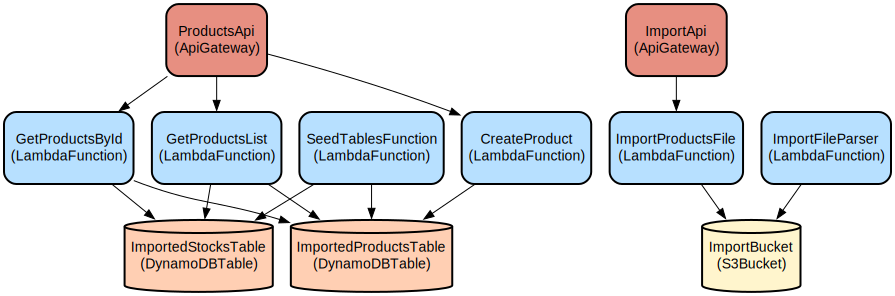

# AWS Serverless E-commerce Backend with Product Management and CSV Import

This project implements a serverless e-commerce backend using AWS services, providing product management capabilities and CSV-based product import functionality. The system leverages AWS Lambda, DynamoDB, S3, and API Gateway to deliver scalable and cost-effective product management operations.

The backend consists of two main services:
- Product Service: Manages product data through a RESTful API, including creating products, retrieving product lists, and getting product details.
- Import Service: Handles CSV file uploads for bulk product data import, with automated processing and file management.

## Repository Structure
```
nodejs-aws-shop-backend/
├── backend/
│   ├── import_service/           # CSV import functionality
│   │   ├── src/
│   │   │   ├── handlers/        # Lambda functions for file operations
│   │   │   └── lib/            # Infrastructure setup with CDK
│   ├── product_service/         # Product management functionality
│   │   ├── src/
│   │   │   ├── handlers/       # Lambda functions for product operations
│   │   │   ├── lib/           # Infrastructure setup with CDK
│   │   │   └── tests/         # Unit tests for handlers
│   │   └── docs/              # API documentation (OpenAPI)
│   └── shared/                 # Shared utilities and configurations
```

## Usage Instructions
### Prerequisites
- Node.js (latest stable version recommended)
- AWS CLI configured with appropriate credentials
- AWS CDK CLI installed globally (`npm install -g aws-cdk`)
- An AWS account with necessary permissions

### Installation
1. Clone the repository:
```bash
git clone <repository-url>
cd nodejs-aws-shop-backend
```

2. Install all dependencies:
```bash
# Install all dependencies at once
npm run install:all

# Or install dependencies individually:
npm run install:shared        # For shared dependencies
npm run install:product_service  # For product service
npm run install:import_service   # For import service
```

### Quick Start
1. Deploy the Product Service:
```bash
cd backend/product_service
npm run cdk deploy
```

2. Deploy the Import Service:
```bash
cd backend/import_service
npm run cdk deploy
```

3. Note the API endpoints output after deployment.

### More Detailed Examples
#### Creating a Product
```typescript
// POST /products
const product = {
  title: "Sample Product",
  description: "Product description",
  price: 99.99,
  count: 10
};

await fetch('YOUR_API_ENDPOINT/products', {
  method: 'POST',
  headers: { 'Content-Type': 'application/json' },
  body: JSON.stringify(product)
});
```

#### Importing Products via CSV
```typescript
// GET /import?name=products.csv
const response = await fetch('YOUR_IMPORT_API_ENDPOINT/import?name=products.csv');
const { signedUrl } = await response.json();

// Upload CSV file using the signed URL
await fetch(signedUrl, {
  method: 'PUT',
  body: csvContent
});
```

### Troubleshooting
#### Common Issues
1. Deployment Failures
- Error: "Resource already exists"
  - Solution: Ensure no conflicting resources exist in your AWS account
  - Run `cdk destroy` and try deploying again

2. CSV Import Issues
- Error: "Access Denied to S3"
  - Check Lambda IAM roles and S3 bucket policies
  - Verify the correct bucket name in environment variables
  - Enable debug logging: Set `DEBUG_MODE=true` in Lambda environment variables

3. Product Creation Failures
- Error: "Transaction failed"
  - Check DynamoDB capacity units
  - Verify table names in environment variables
  - Review CloudWatch logs for detailed error messages

## Data Flow
The system processes data through two main pathways: direct product management and CSV import.

```ascii
Product Management Flow:
API Gateway → Lambda → DynamoDB
     ↑          ↓         ↑
    REST     Validation   │
     │          │         │
     └──────────┴─────────┘

CSV Import Flow:
Client → API Gateway → Lambda → S3 (uploaded/) 
                               ↓
                         Lambda Trigger
                               ↓
                        S3 (parsed/) → DynamoDB
```

Key Component Interactions:
1. Product Service handles direct CRUD operations through API Gateway
2. Import Service generates pre-signed URLs for CSV uploads
3. S3 triggers Lambda function on file upload to "uploaded/" folder
4. Import parser processes CSV files and moves them to "parsed/" folder
5. Processed data is stored in DynamoDB tables
6. CORS headers ensure secure cross-origin communication
7. Error handling and validation occur at each step

## Infrastructure


### Lambda Functions
- `GetProductsList`: Retrieves all products with stock information
- `GetProductsById`: Retrieves specific product details
- `CreateProduct`: Creates new products with stock information
- `ImportProductsFile`: Generates pre-signed URLs for CSV upload
- `ImportFileParser`: Processes uploaded CSV files

### DynamoDB Tables
- `products`: Stores product information
- `stocks`: Stores product stock information

### S3 Bucket
- Stores CSV files in `uploaded/` and `parsed/` folders
- Configured with CORS and event notifications

### API Gateway
- Products API: Handles product management endpoints
- Import API: Manages CSV file import process

## Deployment
1. Prerequisites:
- AWS credentials configured
- CDK bootstrapped in your AWS account

2. Deployment Steps:
```bash
# Deploy all services at once
npm run cdk:deploy:all

# Or deploy individual services: [[1]](https://aws.amazon.com/blogs/mt/serverless-governance-of-software-deployed-with-aws-service-catalog/)
npm run cdk:deploy:product_service     # Deploy Product Service
npm run cdk:deploy:import_service      # Deploy Import Service
npm run cdk:deploy:authorization_service # Deploy Authorization Service
```

3. Environment Configuration:
- Update `shared/src/config.ts` with appropriate values
- Set required environment variables in CDK stacks

4. Monitoring:
- CloudWatch Logs enabled for all Lambda functions
- API Gateway metrics available in CloudWatch
- S3 bucket access logs configured